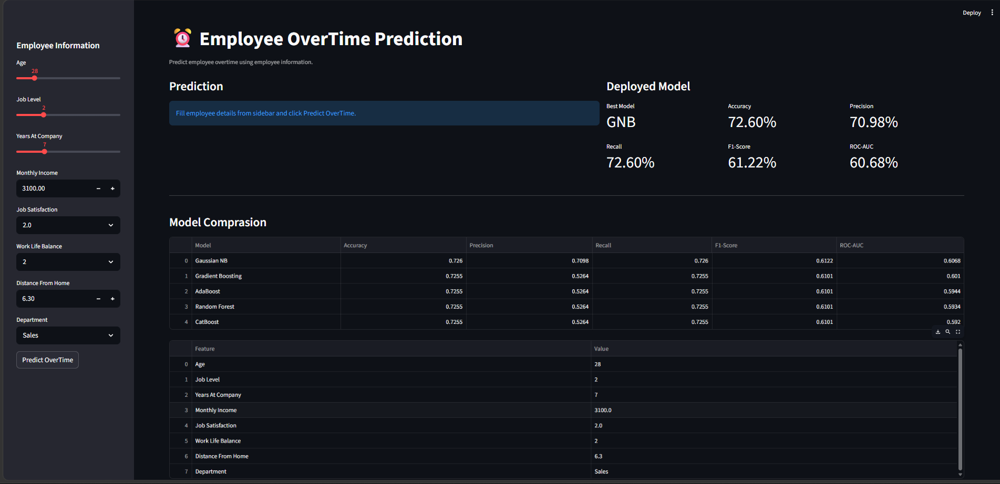
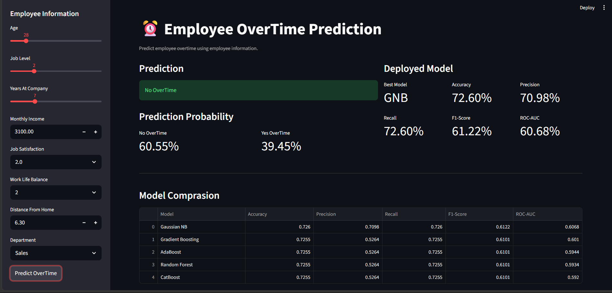

<p align="center">

# ⏰ Employee OverTime Prediction


🚀 **Live Demo:**  
https://akhlaque03-employee-overtime-predictor.streamlit.app/

</p>

---


# ⏰ Employee OverTime Prediction

##  Project Overview

This project predicts whether an employee is likely to work **OverTime** based on employee-related information such as age, job level, monthly income, work-life balance, job satisfaction, department, and years at the company.

The project follows a complete end-to-end Machine Learning workflow, including data preprocessing, exploratory data analysis, feature engineering, model comparison, hyperparameter tuning, model selection, and deployment using Streamlit.

---

##  Problem Statement

Employee overtime has a significant impact on productivity, employee well-being, and organizational performance. This project aims to build a machine learning model that predicts whether an employee is likely to work overtime based on historical employee data.

---

##  Dataset

* Employee OverTime Dataset
* Target Variable: **OverTime**

  * **0 → No OverTime**
  * **1 → Yes OverTime**

---

##  Technologies Used

### Programming & Data Processing
- Python
- Pandas
- NumPy

### Data Visualization
- Matplotlib

### Machine Learning
- Scikit-learn
- Joblib

### Deployment & Tools
- Streamlit
- Jupyter Notebook
- GitHub

---

## 📊 Machine Learning Workflow

* Data Cleaning
* Exploratory Data Analysis (EDA)
* Feature Engineering
* Train-Test Split
* Model Building
* Model Evaluation
* Hyperparameter Tuning
* Model Comparison
* Final Model Selection
* Streamlit Deployment

---

## 🤖 Models Evaluated

The following classification algorithms were trained and evaluated:

- Logistic Regression
- Decision Tree Classifier
- Random Forest Classifier
- Gradient Boosting Classifier
- XGBoost Classifier
- LightGBM Classifier
- CatBoost Classifier
- K-Nearest Neighbors (KNN)
- Support Vector Machine (SVM)
- Gaussian Naive Bayes (GNB)
- AdaBoost Classifier
- Extra Trees Classifier

---

## 🏆 Final Model

### Gaussian Naive Bayes (GNB)

After evaluating multiple classification algorithms, Gaussian Naive Bayes achieved the best overall performance based on weighted evaluation metrics and ROC-AUC score.
---

## 📊 Evaluation Metrics

The classification models were evaluated using the following performance metrics:

- Accuracy
- Precision (Weighted)
- Recall (Weighted)
- F1-Score (Weighted)
- ROC-AUC Score

ROC-AUC was considered as an important metric for comparing model performance because it provides better evaluation for classification problems.

---

## 💻 Streamlit Application Features

The deployed Streamlit application provides:

- Employee information input through an interactive sidebar
- Real-time OverTime prediction
- Prediction probability display
- Final model performance summary
- Model comparison visualization
- Selected employee scenario analysis

---

##  Project Structure

```text
Employee_OverTime_Prediction/
│
├── app.py
├── Employee_OverTime_Prediction.ipynb
├── employee_dataset.csv
├── gnb_final_model.pkl
├── feature_columns.pkl
├── requirements.txt
├── README.md
└── screenshots/
```


---

## 📸 Application Preview

### 🏠 Home Page



---

###  Prediction Result



---

## 🔮 Future Improvements

- Improve minority class prediction using advanced sampling techniques.
- Experiment with advanced ensemble learning methods.
- Apply feature selection techniques for better model performance.
- Improve model calibration and prediction confidence.
- Implement deployment monitoring and model performance tracking.

---

## 👨‍💻 Author

**Akhlaque Alam**

* Data Science Enthusiast
* Python | SQL | Machine Learning | Streamlit
* Open to Data Science and Machine Learning opportunities.
